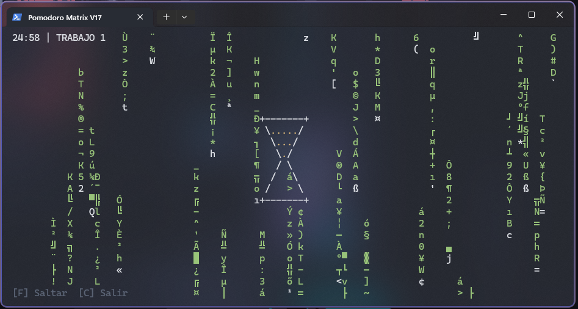
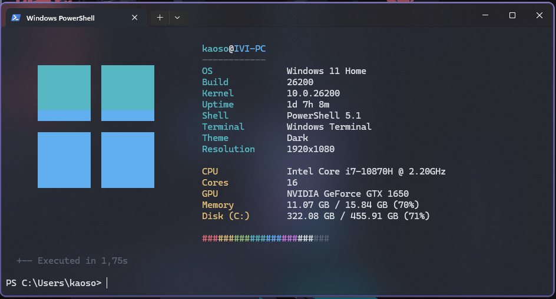

# PowerShell Scripts & Projects

A collection of high-performance PowerShell scripts and utilities for Windows.

---

## Quick Start

```powershell
# 1. Clone the repository
git clone https://github.com/iviivanoff24/powershell-scripts.git
cd powershell-scripts

# 2. Run the installer (adds scripts to PATH)
.\install.bat

# 3. Restart PowerShell and run
matrix.ps1
pomodoro.ps1
osfetch.ps1
```

---

## 📋 Projects

### 1. Matrix Digital Rain
**Location:** `Matrix/matrix.ps1`

A digital rain simulation inspired by the movie "The Matrix" with smooth, high-FPS rendering.


**Features:**
- High-performance rendering using native Windows API (via embedded C#)
- Auto-resizing support
- Optional digital clock overlay
- Authentic fading trails (white head, neon glow, dark body)
- Clean exit with 'F' key

**Usage:**
```powershell
cd Matrix
pwsh ./matrix.ps1

# With parameters
pwsh ./matrix.ps1 -Velocidad 50 -MostrarReloj $true
```

**Parameters:**
- `-Velocidad <ms>`: Set refresh rate (default: 30)
- `-MostrarReloj $true|$false`: Show digital clock overlay

---

### 2. Pomodoro Timer with Matrix Effect
**Location:** `Pomodoro - Matrix/pomodoro.ps1`

A Pomodoro timer with Matrix-style visual effects and robust console management.



**Features:**
- Pomodoro timer with Matrix-style visuals
- Red screen flash for breaks (buffer always resets to black)
- Cleans up console state between sessions

**Usage:**
```powershell
cd "Pomodoro - Matrix"
pwsh ./pomodoro.ps1
```

---

### 3. Osfetch
**Location:** `Osfetch/osfetch.ps1`

A hyper-fluid alternative to winfetch/neofetch optimized for speed.



**Features:**
- Ultra-fast system information display (caches results)
- minimal WMI/CIM queries
- Customizable logos (Windows 10, 11, Minimal, etc.)

**Usage:**
```powershell
cd Osfetch
pwsh ./osfetch.ps1

# With custom logo
pwsh ./osfetch.ps1 -Logo minimal
```

**Parameters:**
- `-Logo <string>`: Select logo from `default`, `minimal`, `simple`, `windows`, `windows10`, `windows11` (Default: `windows11`)

---

## 📦 More Projects Coming Soon

This repository will be updated with additional PowerShell scripts and utilities.

---

## Installation

### Prerequisites
- **Windows 10/11** with PowerShell 5.1 or later (or PowerShell 7+)
- **Optional:** Console font supporting Japanese Katakana (e.g., MS Gothic, NSimSun) for Matrix scripts

### Automated Installation (Recommended)

1. **Run the installer batch file:**
   ```cmd
   install.bat
   ```
   This automatically:
   - Detects PowerShell (prefers `pwsh` over `powershell`)
   - Adds script directories to your user PATH
   - Updates environment variables

2. **Restart PowerShell** and run scripts from anywhere:
   ```powershell
   matrix.ps1
   pomodoro.ps1
   osfetch.ps1
   ```

### 🔁 Auto-Run on Startup
To execute `osfetch` automatically when opening any terminal (CMD or PowerShell):

1. **Enable Auto-Run:**
   ```cmd
   .\Osfetch\setup-autorun.bat
   ```

2. **Disable/Remove Auto-Run:**
   ```cmd
   .\Osfetch\remove-autorun.bat
   ```

### Manual Installation (Alternative)

1. **Open your PowerShell profile:**
   ```powershell
   notepad $PROFILE
   # If file doesn't exist, create it first:
   # New-Item -Path $PROFILE -Type File -Force
   ```

2. **Add these functions:**
   ```powershell
   function Start-Matrix {
       param(
           [int]$Velocidad = 30,
           [bool]$MostrarReloj = $false
       )
       & "C:\path\to\powershell-scripts\Matrix\matrix.ps1" -Velocidad $Velocidad -MostrarReloj $MostrarReloj
   }
   Set-Alias -Name matrix -Value Start-Matrix
   
   function Start-Pomodoro {
       & "C:\path\to\powershell-scripts\Pomodoro - Matrix\pomodoro.ps1"
   }
   Set-Alias -Name pomodoro -Value Start-Pomodoro

   function Start-Osfetch {
       param([string]$Logo = 'windows11')
       & "C:\path\to\powershell-scripts\Osfetch\osfetch.ps1" -Logo $Logo
   }
   Set-Alias -Name osfetch -Value Start-Osfetch
   ```

3. **Reload profile:**
   ```powershell
   . $PROFILE
   ```

---

## ❓ Troubleshooting

### PowerShell Not Found
**Error:** "PowerShell is not installed"

**Solution:** Install PowerShell 7 from [microsoft.com/powershell](https://microsoft.com/powershell) or use Windows PowerShell (built-in).

### Script Execution Policy Error
**Error:** "cannot be loaded because running scripts is disabled"

**Solution:**
```powershell
Set-ExecutionPolicy -ExecutionPolicy RemoteSigned -Scope CurrentUser
```

### Scripts Not Found in PATH
**Error:** "matrix.ps1 : The term 'matrix.ps1' is not recognized"

**Solution:**
1. Re-run `install.bat`
2. **Restart PowerShell completely** (close all windows)
3. Verify PATH:
   ```powershell
   $ENV:PATH -split ';' | Select-String 'Matrix|Pomodoro'
   ```

### Unicode/Japanese Characters Not Displaying
**Problem:** Matrix shows garbled characters instead of Katakana

**Solution:**
1. Open **Windows Terminal Settings** (or Command Prompt title bar → Properties)
2. Go to **Font** settings
3. Select a font with CJK support: **MS Gothic**, **NSimSun**, or any **Nerd Font**
4. Restart the script

---

## License
MIT
